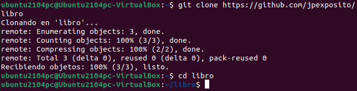
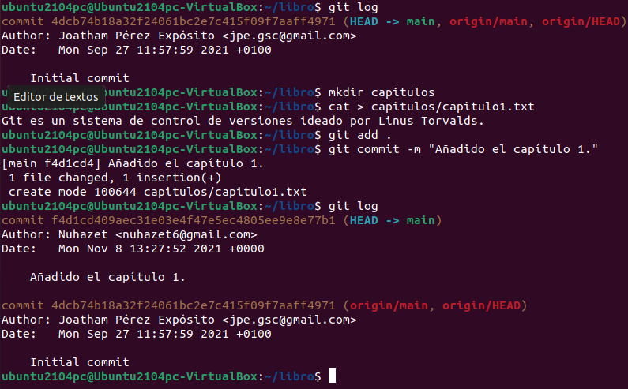
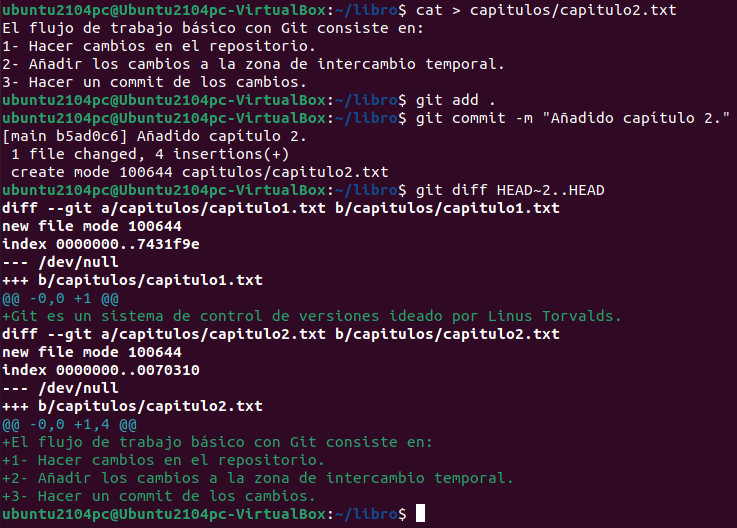

#Ejemplos en Git
Para hacer esta actividad primero haremos un clon del repositorio "https://github.com/jpexposito/libro" y empezaremos a trabajar sobre el mismo.
```
git clone https://github.com/jpexposito/libro
cd libro
```


## Ejercicio 1

1. Mostramos el historial del repositorio
2. creamos carpeta capítulos y creamos dentro el fichero capitulo1.txt con el texto "Git es un sistema de control de versiones ideado por Linus Torvalds".
3. Añadimos los cambios a la zona de intercambio temporal.
4. Hacemos un commit de los cambios con el mensaje Añadido capítulo 1.
5. Volvemos a mostra el historial.
```
1. git log
2. mkdir capitulos
cat > capitulos/capitulo1.txt
Git es un sistema de control de versiones ideado por Linus Torvalds.
Ctrl+D
3. git add .
4. git commit -m "Añadido capítulo 1."
5. git log
```


## Ejercicio 2

a. Crear el fichero capitulo2.txt en la carpeta capítulos con el texto "El flujo de trabajo básico con Git consiste en: 1- Hacer cambios en el repositorio. 2- Añadir los cambios a la zona de intercambio temporal. 3- Hacer un commit de los cambios".
b. Añadir los cambios a la zona de intercambio temporal.
c. Hacer un commit de los cambios con el mensaje _Añadido capítulo 2._
d. Mostrar las diferencias entre la última versión y dos versiones anteriores.

```
 a. cat > capitulos/capitulo2.txt
 El flujo de trabajo básico con Git consiste en:
 1- Hacer cambios en el repositorio.
 2- Añadir los cambios a la zona de intercambio temporal.
 3- Hacer un commit de los cambios.
 Ctrl+D
 b. git add .
 c. git commit -m "Añadido capítulo 2."
 d. git diff HEAD~2..HEAD
```


## Ejercicio 3

1. Crear el fichero capitulo3.txt en la carpeta capítulos con el texto "Git permite la creación de ramas lo que permite tener distintas versiones del mismo proyecyo y trabajar de manera simultanea en ellas".
2. Añadir los cambios a la zona de intercambio temporal.
3. Hacer un commit de los cambios con el mensaje _Añadido capítulo 3._
4. Mostrar las diferencias entre la primera y la última versión del repositorio.


```
 > cat > capitulos/capitulo3.txt
 Git permite la creación de ramas lo que permite tener distintas versiones del mismo proyecto y trabajar de manera simultanea en ellas.
 Ctrl+D
 > git add .
 > git commit -m "Añadido capítulo 3."
 > git log
 > git diff <codigo hash de la primera version>..HEAD
```

## Ejercicio 4

- Crea el fichero índice.txt la siguiente línea:
```console
Indice de los cápitulos, con conceptos avanzados de git
```
- Añadir los cambios a la zona de intercambio temporal.
- Hacer un commit de los cambios con el mensaje _"Indice de los cápitulos, con conceptos avanzados de git_.
- Mostrar quién ha hecho cambios sobre el fichero _indice.txt_.

<details>
  <summary>PULSA PARA VER LA SOLUCIÓN:</summary>

```console
 > cat > indice.txt
 > git add .
 > git commit -m "Se crea el indice."
 > echo "Indice de los cápitulos, con conceptos avanzados de git" >> indice.txt
 > git add .
 > git commit -m "Añadido el índice ."
 > git annotate indice.txt
 ```

</details>

## Ejercicio 5

Crear una nueva rama bibliografía y mostrar las ramas del repositorio.

<details>
  <summary>PULSA PARA VER LA SOLUCIÓN:</summary>

```console
  git branch bibliografia
  > git branch -av
```

</details>


## Ejercicio 6

 - Crear el fichero capitulos/capitulo4.txt y añadir el texto siguiente:

```console
  En este capítulo veremos cómo usar GitHub para alojar repositorios en remoto.
```

 - Añadir los cambios a la zona de intercambio temporal.
 - Hacer un commit con el mensaje “Añadido capítulo 4.”
 - Mostrar la historia del repositorio incluyendo todas las ramas.

<details>
 <summary>PULSA PARA VER LA SOLUCIÓN:</summary>

```console
> cat > capitulos/capitulo4.txt
En este capítulo veremos cómo usar GitHub para alojar repositorios en remoto.
Ctrl+D
> git add .
> git commit -m "Añadido capítulo 4."
> git log --graph --all --oneline
```

</details>

## Ejercicio 7

 - Cambiar a la rama bibliografía.
 - Crear el fichero bibliografia.txt y añadir la siguiente referencia:
```console
Chacon, S. and Straub, B. Pro Git. Apress.
```
 - Añadir los cambios a la zona de intercambio temporal.
 - Hacer un commit con el mensaje “Añadida primera referencia bibliográfica.”
 - Mostrar la historia del repositorio incluyendo todas las ramas.

<details>
  <summary>PULSA PARA VER LA SOLUCIÓN:</summary>

```console
 > git checkout bibliografia
 > cat > bibliografia.txt
 - Chacon, S. and Straub, B. Pro Git. Apress.
 Ctrl+D
 > git add .
 > git commit -m "Añadida primera referencia bibliográfica."
 > git log --graph --all --oneline
```

 </details>

## Ejercicio 8

 - Fusionar la rama bibliografía con la rama main.
 - Mostrar la historia del repositorio incluyendo todas las ramas.
 - Eliminar la rama bibliografía.
 - Mostrar de nuevo la historia del repositorio incluyendo todas las ramas.

<details>
  <summary>PULSA PARA VER LA SOLUCIÓN:</summary>

 ```console
 > git checkout main
> git merge bibliografia
> git log --graph --all --oneline
> git branch -d bibliografia
> git log --graph --all --oneline
 ```

 </details>

## Ejercicio 9
 - Crear la rama bibliografía.
 - Cambiar a la rama bibliografía.
 - Cambiar el fichero bibliografia.txt para que contenga las siguientes referencias:
```cosole
Scott Chacon and Ben Straub. Pro Git. Apress.
Ryan Hodson. Ry’s Git Tutorial. Smashwords (2014)
```
 - Cambiar a la rama main.
 - Cambiar el fichero bibliografia.txt para que  - contenga las siguientes referencias:
```console
Chacon, S. and Straub, B. Pro Git. Apress.
Loeliger, J. and McCullough, M. Version control with Git. O’Reilly.
```
 - Añadir los cambios a la zona de intercambio temporal y hacer un commit con el mensaje “Añadida nueva referencia bibliográfica.”
 - Fusionar la rama bibliografía con la rama main.
 - Resolver el conflicto dejando el fichero bibliografia.txt con las referencias:
```console
Chacon, S. and Straub, B. Pro Git. Apress.
Loeliger, J. and McCullough, M. Version control with Git. O’Reilly.
```
Hodson, R. Ry’s Git Tutorial. Smashwords (2014)
 - Añadir los cambios a la zona de intercambio temporal y hacer un commit con el mensaje “Resuelto conflicto de bibliografía.”
 - Mostrar la historia del repositorio incluyendo todas las ramas.

<details>
  <summary>PULSA PARA VER LA SOLUCIÓN:</summary>

 ```console
 > git branch bibliografia
 > git checkout bibliografia
 > cat > bibliografia.txt
 - Scott Chacon and Ben Straub. Pro Git. Apress.
 - Ryan Hodson. Ry's Git Tutorial. Smashwords (2014)
 Ctrl+D
 > git commit -a -m "Añadida nueva referencia bibliográfica."
 > git checkout main
 > cat > bibliografia.txt
 - Chacon, S. and Straub, B. Pro Git. Apress.
 - Loeliger, J. and McCullough, M. Version control with Git. O'Reilly.
 Ctrl+D
 > git commit -a -m "Añadida nueva referencia bibliográfica."
 > git merge bibliografia
 > git nano bibliografia
 # Hacer los cambios indicados en el fichero
 > git commit -a -m "Solucionado conflicto bibliografía."
 > git log --graph --all --oneline
 ```

 </details>
