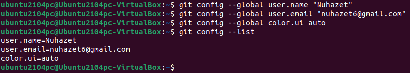
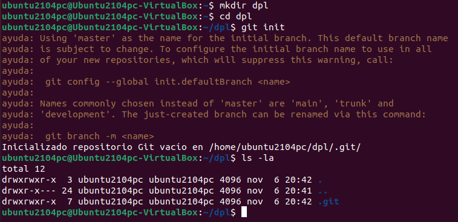
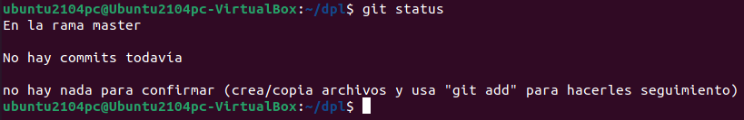
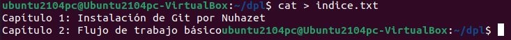
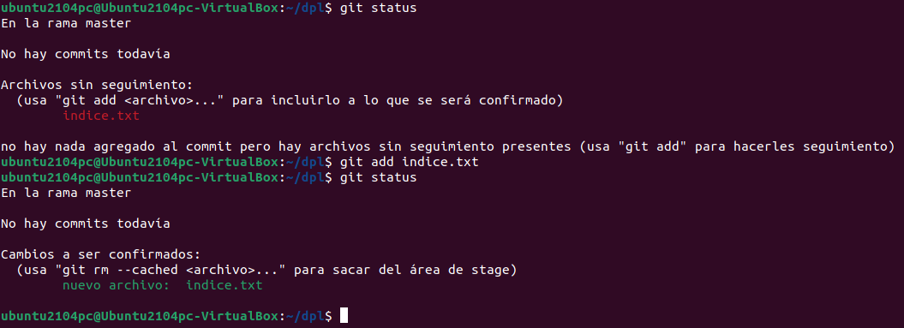

# Tarea 2: Manipulación de repositorios en Git

## Introducción

EL objetivo del siguiente archivo es documentar la manipulación básica de repositorios en GIT.

## Requisitos previos

 Tener una distribución Linux, y realizar la tarea [instalación y configuración de git](../instalación-git.md)  


## Pasos

### 1.Configuración

 Cofiguramos Git definiendo el nombre de usuario, correo electrónico, activamos el color de salida y mostramos la configuración final con los siguientes comandos:

```
  git config --global user.name "Your-Full-Name"
  git config --global user.email "your-email-address"
  git config --global color.ui auto
  git config --list
```


### 2.Creación de un repositorio

 Creamos un repositorio nuevo con el nombre _dpl_ y mostramos su contenido con estos comandos:

```
 mkdir dpl
 cd dpl
 git init
 ls -la
 ```
 

### 3.Comprobar el estado del repositorio

 - Comprobar el estado del repositorio.

 ```
 git status
 ```
 

 - Crear un fichero indice.txt con el siguiente contenido:
   - Capítulo 1: Instalación de Git por el nombre XXX _(donde XXX es tu nombre)_
   - Capítulo 2: Flujo de trabajo básico
```
cat > indice.txt
Capítulo 1: Instalación de Git por el alumno XXX
Capítulo 2: Flujo de trabajo básico
```

  
 - Comprobar de nuevo el estado del repositorio.
 - Añadir el fichero a la zona de intercambio temporal.
 - Volver a comprobar una vez más el estado del repositorio.

```
 Ctrl+D
 git status
 git add indice.txt
 git status
```
 


### 4.Realizando Commit´s

 Realizar un commit de los últimos cambios con el mensaje __Añadido índice de la asignatura DPL.__ y ver el estado del repositorio.

```
git commit -m "Añadido índice de la asignatura DPL."
git status
```
 


### 5.Modificación de ficheros

 - Cambiar el fichero indice.txt para que contenga lo siguiente:
   - Capítulo 1: Instalación de Git por el alumno XXX _(donde XXX es el nombre del alumno)_
   - Capítulo 2: Flujo de trabajo básico
   - Capítulo 3: Gestión de ramas
   - Capítulo 4: Repositorios remotos
 - Mostrar los cambios con respecto a la última versión guardada en el repositorio.
 - Hacer un commit de los cambios con el mensaje __Añadido los capitulos 3 y 4__.

```
cat > indice.txt
Capítulo 1: Instalación de Git por el alumno XXX _(donde XXX es el nombre del alumno)_
Capítulo 2: Flujo de trabajo básico
Capítulo 3: Gestión de ramas
Capítulo 4: Repositorios remotos
Ctrl+D
git diff
git add indice.txt
git commit -m "Añadido los capitulos 3"
```
 


### 6.Historial

 - Mostrar los cambios de la última versión del repositorio con respecto a la anterior.
 - Cambiar el mensaje del último commit por __Añadido el capitulo sobre gestión de ramas al índice.__
 - Volver a mostrar los últimos cambios del repositorio.

```
git show
git commit --amend -m "Añadido el capitulo sobre gestión de ramas al índice."
git show
```
 
