# Instalación de Git en linux
Se mostrará cómo instalar y configurar Git en Ubuntu 21.04. Se realizará la instalación de dos maneras distintas: a través del administrador de paquetes integrado y a través de la fuente.

## Índice
1.[Instalación de Git con paquetes predeterminados](#id1)

2.[Instalación desde la fuente](#id2)

3.[Configuración de Git](#id3)

## Instalación de Git con paquetes predeterminados<a name="id1"></a>
1.	Primero verificamos si hay alguna versión de Git instalada escribiendo lo siguiente: 

```
git –version
```

 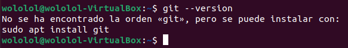
 
2.	Antes de instalar Git actualizamos las herramientas de actualización de paquetes:

```
sudo apt update
```
 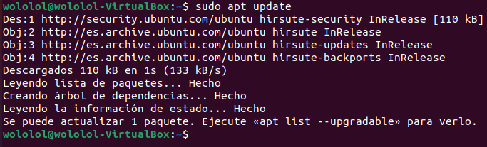
 
3.	Una vez actualizadas, empezamos a instalar Git:

```
sudo apt install git
```

 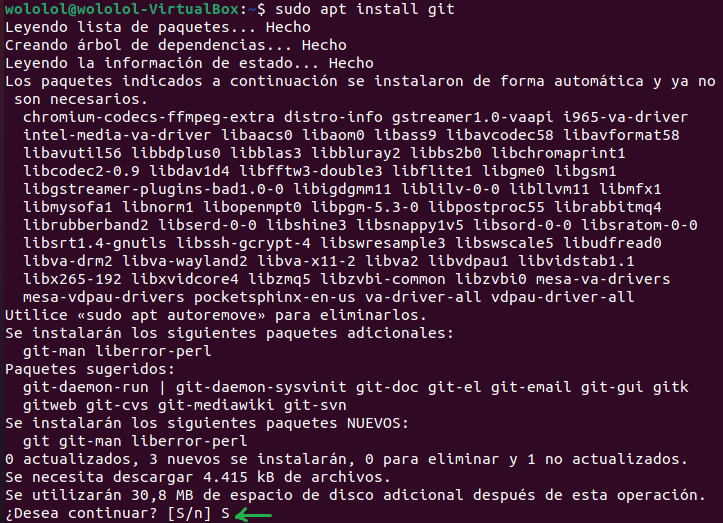
 
4.	Finalmente comprobamos que se haya instalado correctamente:

```
git –version
```

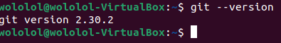

## Instalación de Git desde la fuente<a name="id2"></a>

1.	Primero comprobamos la versión:


```
git --version
```

__Output__

```
git version 2.30.2
```


2.	Antes de empezar debemos actualizar nuestro índice local de paquetes:

```
sudo apt update
```

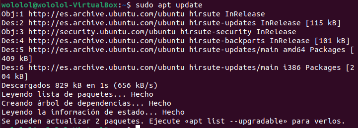

3.	A continuación, instalamos los paquetes pertinentes:
```
sudo apt install libz-dev libssl-dev libcurl4-gnutls-dev libexpat1-dev gettext cmake gcc
``` 

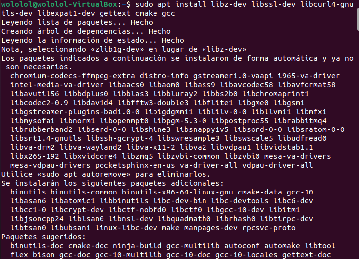
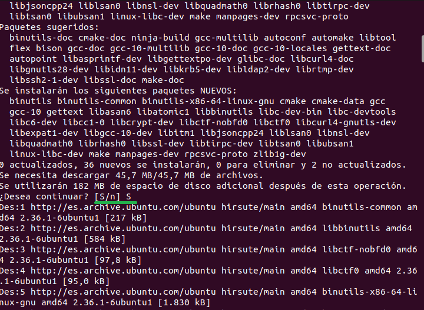

4.	Tras esto descargamos la versión específica de Git:
Desde el sitio web del proyecto Git, podemos navegar a la lista de tarball disponible en https://mirrors.edge.kernel.org/pub/software/scm/git/ y descargar la versión que quiera utilizar.
```
curl -o git.tar.gz https://mirrors.edge.kernel.org/pub/software/scm/git/git-2.29.3.tar.gz
``` 
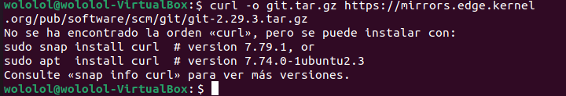
5.	El error se debe a que tenemos que instalar el curl para usar el comando “curl” así que lo instalamos:
```
sudo snap install curl
```
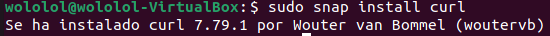
6.	Una vez instalado, volvemos a hacer el comando curl, descomprimimos el archivo con tar y entramos con cd al nuevo directorio:
```
curl -o git.tar.gz https://mirrors.edge.kernel.org/pub/software/scm/git/git-2.29.3.tar.gz 
```
```
tar -zxf git.tar.gz
``` 
```
cd git-*
``` 
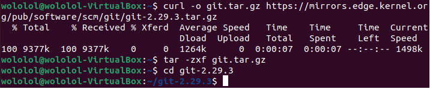

8.	Ahora creamos el paquete y lo instalamos:

```
make prefix=/usr/local all
```
```
sudo make prefix=/usr/local install
``` 
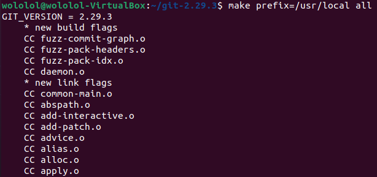
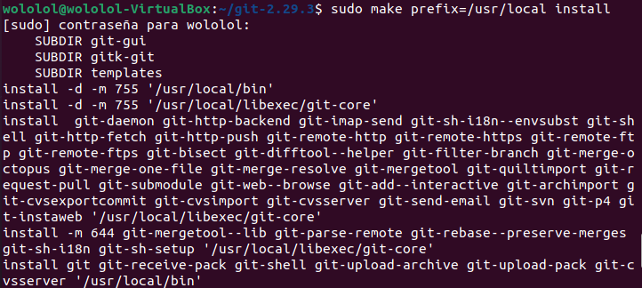
9.	Elegimos el git que acabamos de instalar con "exec bash" y comprobamos que efectivamente tenemos la versión que queremos con version:
```
 exec bash
```
```
git --version
```
__Output__
git version 2.29.3

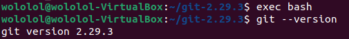
Con Git instalado correctamente, ahora puede finalizar su configuración.

## Configuración de Git <a name="id3"></a>
1.	Vamos a poner nuestro nombre de usuario y correo:
```
git config --global user.name "Tu nombre"
git config --global user.email "tuemail@dominio.com"
```

2.	Comprobamos los elementos de la configuración:

```
git config --list
```
__Output__

```
user.name=Tu nombre
user.email=tuemail@dominio.com
```
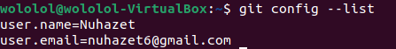
La información que ingresa se almacena en el archivo de configuración de Git. Tendrá la opción de editarlo manualmente con el editor de texto que prefiera (en este tutorial utilizaremos nano) como se muestra a continuación:

```
nano ~/.gitconfig
```

``` 
~/.gitconfig contents
[user]
  name = Tu nombre
  email = tuemail@dominio.com
```
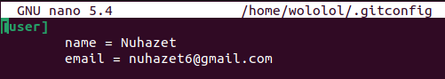

Para salir del editor de texto pulse CTRL y X, luego Y y, a continuación, ENTER.

Listo ya tenemos el git instalado y configurado listo para usar.
