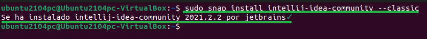
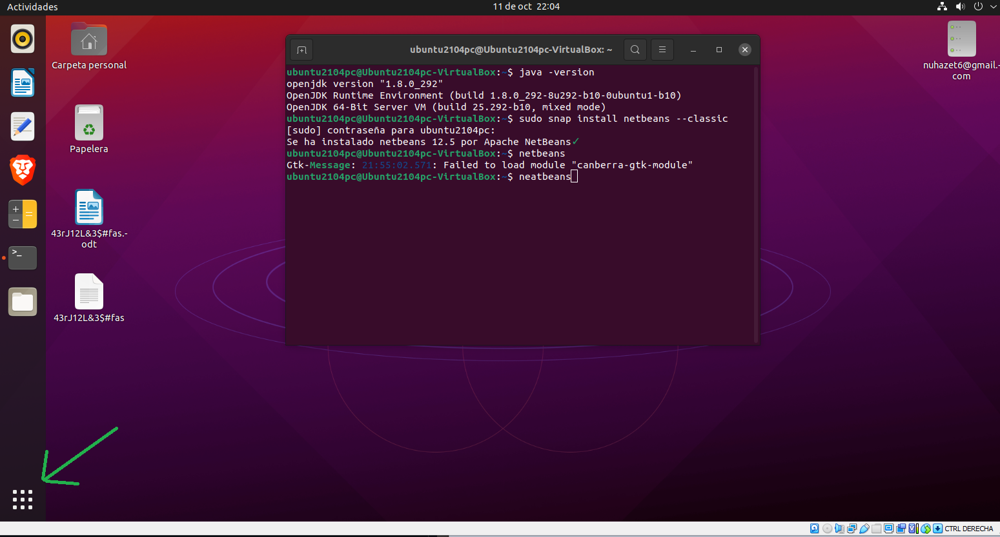
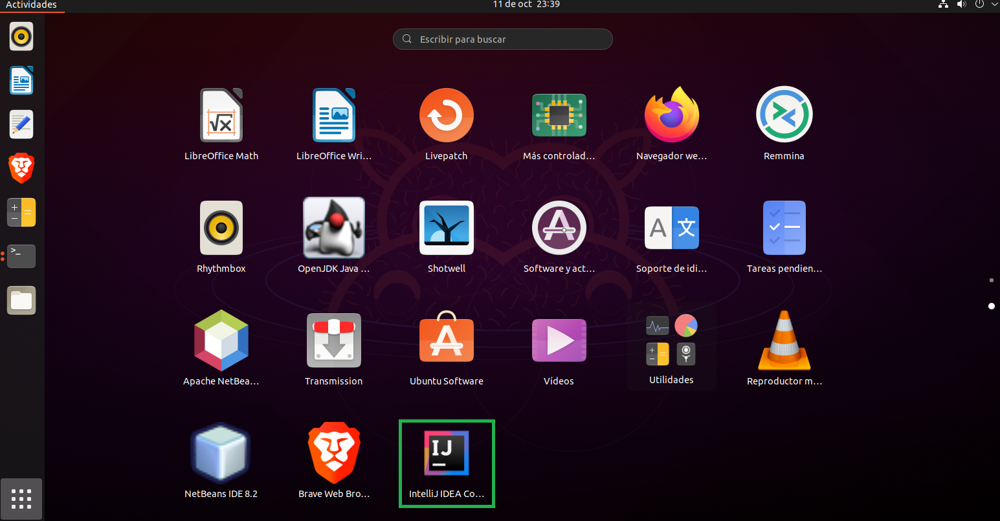

<div align="justify">

# Instalación del IDE IntelliJ IDEA

<div align="center">
  
</div>


## Pasos

### Prerrequisitos

Para instalar NetBeans primero necesitamos haber instalado Java. Los pasos para realizar su instalación y configuración se encuentra en el siguiente [https://github.com/nuhazet6/jdk/blob/4543e358060c3cdcf33c71454588e322a8b98518/Instalaci%C3%B3nJdk.md](tarea-jdk.md).

  Para verificarlo usamos el siguiente comando:

```console
java -version
```
  

## Instalación

  Para instalar la edición Community, ejecute el siguiente comando:

```console
sudo snap install intellij-idea-community --classic
```
  Cuando se termine de instalar aparecerá un mensaje indicando que se ha instalado 
correctamente.
  

  
### Lanzamiento de IntelliJ

 Para ejecutar IntelliJ vamos a “Mostrar aplicaciones” abajo a la izquierda y buscamos el 
icono de IntelliJ para darle click.

 
  
  

  </div>
