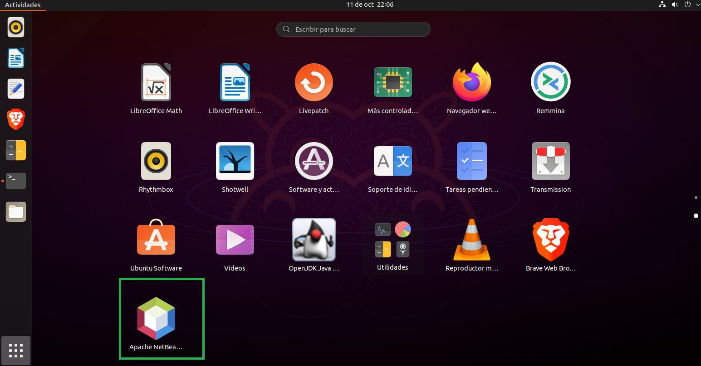

<div align="justify">

# Instalación del IDE NetBeans12

<div align="center">
  
</div>


## Pasos

### Prerrequisitos

Para instalar NetBeans primero necesitamos haber instalado Java. Los pasos para realizar su instalación y configuración se encuentra en el siguiente [enlace](https://github.com/nuhazet6/jdk/blob/4543e358060c3cdcf33c71454588e322a8b98518/Instalaci%C3%B3nJdk.md).

  Para verificarlo usamos el siguiente comando:

```console
java -version
```
  

## Instalación

  Para instalar NetBeans12 ejecute el siguiente comando:

```console
sudo snap install netbeans –classic
```
  Cuando se termine de instalar aparecerá un mensaje indicando que se ha instalado 
correctamente.
  

  
### Lanzamiento de NetBeans

Para ejecutar NetBeans podemos hacerlo de dos formas:
  
1.Escribiendo netbeans en la terminal
  
  
  
2. Yendo a Mostrar aplicaciones abajo a la izquierda y buscando el icono de NetBeans 
para darle click
  
  
  
  
  
# Eliminar Netbeans

__No realices este paso, es para que conozcas como se elimina__.

 Una vez que no necesite Netbeans en su sistema. Use el siguiente comando para eliminar netbeans del sistema Ubuntu usando el comando snap.

```console
sudo snap remove netbeans
```
</div>
