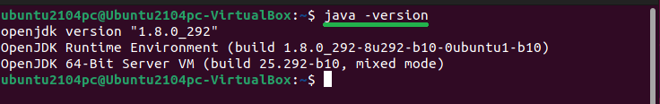
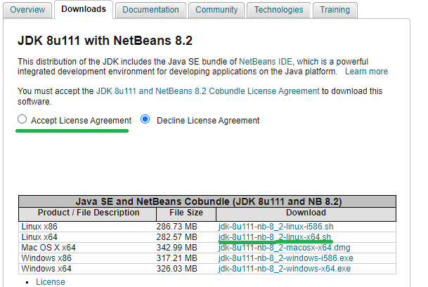
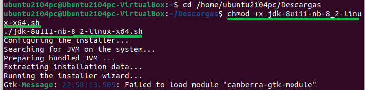
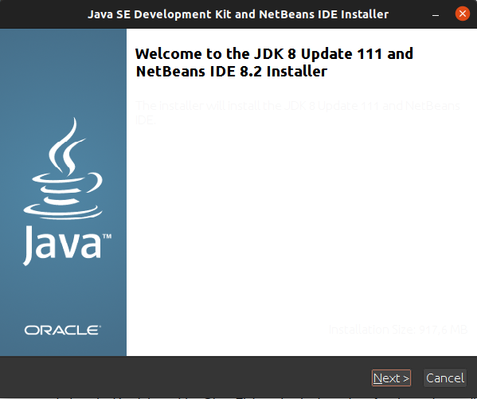
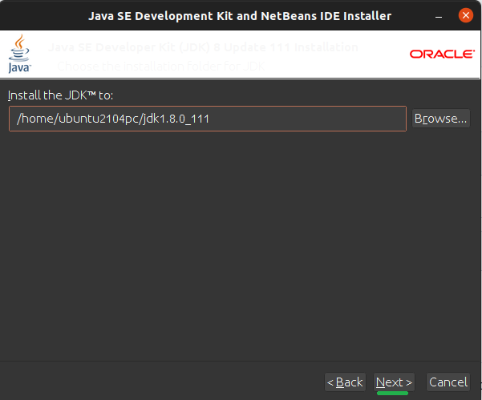
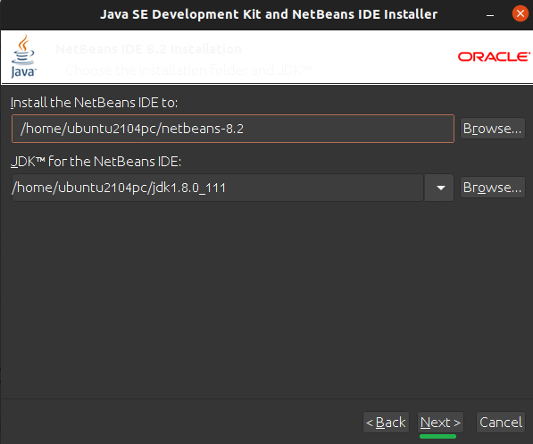
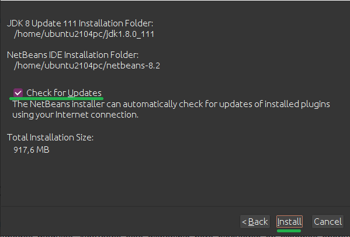

<div align="justify">

# Instalación de NetBeans 8

  <div align="center">
  
</div>

## Prerrequisitos 

Para instalar NetBeans primero necesitamos haber instalado Java. Para comprobarlo usamos el siguiente comando: 

```console
java -version
``` 
  

## Descargar la versión 

Descargar la versión deseada en este[ enlace.](https://www.oracle.com/technetwork/java/javase/downloads/jdk-netbeans-jsp-3413139-esa.html) Hemos de descargar la versión jdk-8u111- nb-8\_2-linux-x64.sh, aceptando Accept License Agreement. 



## Comenzar la Instalación 

Una vez que se complete la descarga, navegue hasta el directorio donde se ha descargado el instalador de NetBeans IDE con: 

  ```console
cd /ruta/de/ejemplo
  ```


y ejecute el siguiente comando: 

  ```console
chmod +x jdk-8u111-nb-8\_2-linux-x64.sh ./jdk-8u111-nb-8\_2-linux-x64.sh 
```
  



## Instalador

Tras poner el último comando se abrirá la ventana de “bienvenida” del instalador, en la que hay que seguir los pasos de una instalación típica (darle next, personalizar si deseamos las rutas de instalación, etc) 



Es recomendable no cambiar de ruta para facilitar el proceso 





Importante dejar marcada la casilla de “Check for Updates” para actualizar automáticamente los complementos instalados 



Cuando se complete la instalación, haga clic en “Finish” y reinicie para disfrutar de NetBeans IDE 
  
  </div>
